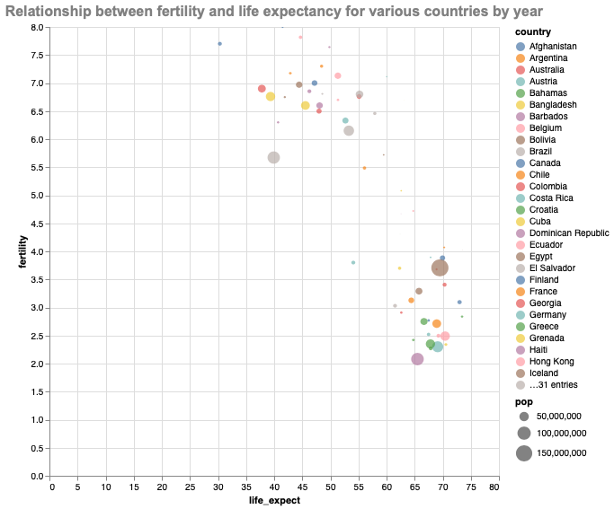

# data_visualization_with_altair

### Introduction

This repo is for my blog post ["Create Stunning Visualizations with Altair"](https://towardsdatascience.com/create-stunning-visualizations-with-altair-f9af7ad5e9b?sk=2b5bfd0ca04b54f8e0f3ed8a69890f19) published on [Medium](https://aigerimshopenova.medium.com/). In the blog post, I share about the basic grammar of Altair visualization package and show some examples of basic graphs such as a box plot, a histogram, a bar chart and so on.

### Getting started
To run the notebook you need the following packages:
* pandas
* altair
* Vega_datasets

### Example of a scatter plot made in Altair

